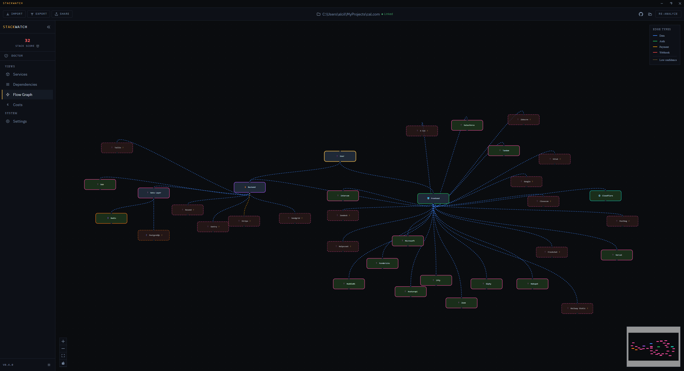

# StackWatch

> Know your stack, own your stack.

[](LICENSE)
[](https://github.com/alciller88/StackWatch/releases/latest)
[]()
[](SECURITY.md)
[](CONTRIBUTING.md)

StackWatch scans your codebase across 9 ecosystems and automatically maps every service, API, database, and paid account your project depends on -- with costs, renewal dates, and an interactive architecture graph. Zero config, works offline, and delivers results in seconds.

<p align="center">
  
</p>

---

## Quick Start

### Download

Pre-built binaries are available on the [Releases page](https://github.com/alciller88/StackWatch/releases/latest):

| Platform | Format |
|----------|--------|
| Windows | `.exe` installer or portable |
| macOS | `.dmg` (universal -- Intel + Apple Silicon) |
| Linux | `.AppImage` or `.deb` |

### From Source

```bash
git clone https://github.com/alciller88/StackWatch.git
cd StackWatch
npm install
npm run dev
```

Requires [Node.js](https://nodejs.org/) 20+ and [Git](https://git-scm.com/). The Electron window opens automatically. WSL2 is detected and handled -- no manual setup needed.

> **Linux users:** StackWatch requires `libsecret` or `kwallet` for credential encryption. Without it, credentials are stored unencrypted and a warning is shown at startup.

### Your First Scan

1. **Open a folder** or connect a GitHub repo from the top bar
2. **Review detected services** -- each card shows confidence level and evidence breakdown
3. **Add what's missing** -- domains, SaaS accounts, costs, renewal dates
4. **Re-analyze anytime** -- merge to keep manual edits or fresh scan to start over

---

## Features

| Feature | Description |
|---------|-------------|
| **Heuristic Detection** | Detects services from env vars, imports, URLs, configs, and CI secrets -- no hardcoded service maps |
| **19 Categories** | Domain, hosting, CI/CD, database, auth, payments, email, analytics, monitoring, CDN, storage, infra, AI, mobile, gaming, data, messaging, support, other |
| **9 Ecosystems** | Node.js (npm), Python (pip), Rust (Cargo), Go, .NET (NuGet), Java (Maven/Gradle), Ruby (gems), PHP (Composer), Dart (pub) |
| **Interactive Flow Graph** | Draggable architecture visualization with auto-layout, context menus, custom connections, and node editing |
| **Billing & Costs** | ServiceBilling model (manual/automatic/free), renewal tracking with per-type thresholds, bar chart, budget mode |
| **Vulnerability Scanning** | Batch queries OSV.dev across 9 ecosystems with severity classification |
| **Zombie Detection** | Cross-references services with git log to find abandoned dependencies (6+ months inactive) |
| **Stack Score** | 8 binary checks (security + completeness), score = passing/applicable × 100 |
| **SBOM Generation** | CycloneDX 1.5 and SPDX 2.3 output from detected dependencies |
| **Stack Diff** | Compare scans to track how your stack changes over time |
| **Monorepo Support** | npm workspaces, pnpm, Lerna, Turborepo, Nx |
| **Dark/Light Theme** | Full theme toggle with WCAG AA contrast compliance |
| **Style Editor** | Customize colors for graph nodes, edges, and layers with real-time preview |
| **Blank Stack Mode** | Build your architecture manually without scanning a repo |

---

## Dashboard Panels

| Panel | What You See |
|-------|-------------|
| **Services** | Detected + manual services with cost, confidence badges, ecosystem badges, evidence breakdown, and AI-generated context |
| **Dependencies** | Full dependency tree with vulnerability scanning |
| **Discarded** | Items filtered during analysis -- searchable, filterable, restorable |
| **Flow Graph** | Interactive architecture graph with drag-and-drop, custom connections, and context menus |
| **Costs** | Cost breakdown by category with bar chart, renewal alerts, and budget mode |
| **Settings** | AI provider config, scan mode, theme toggle, Style Editor (custom colors for nodes, edges and layers) |

---

## CLI

Scan any project from the command line -- same heuristic engine, no Electron required:

```bash
npx stackwatch                        # Scan current directory
npx stackwatch ./my-project           # Scan a specific project
npx stackwatch --json                 # JSON output for piping
npx stackwatch --md > SERVICES.md     # Markdown report
npx stackwatch --html > report.html   # Self-contained HTML report
npx stackwatch --diff                 # Compare with previous scan
npx stackwatch --sbom cyclonedx       # CycloneDX 1.5 SBOM
npx stackwatch --sbom spdx            # SPDX 2.3 SBOM
npx stackwatch --all                  # Include low-confidence services
npx stackwatch --fail-on-vulns        # CI gate: exit 1 on critical/high vulns
npx stackwatch --fail-on-unreviewed   # CI gate: exit 2 on unreviewed services
npx stackwatch init ./my-project      # Generate stackwatch.config.json
npx stackwatch badge ./my-project     # Generate README badges
npx stackwatch doctor                 # Health check with actionable findings
```

---

## GitHub Action

Add StackWatch to your CI pipeline to scan on every PR:

```yaml
# .github/workflows/stackwatch.yml
name: StackWatch Scan
on:
  pull_request:
    branches: [main]

permissions:
  contents: read
  pull-requests: write

jobs:
  scan:
    runs-on: ubuntu-latest
    steps:
      - uses: actions/checkout@v4
      - uses: alciller88/StackWatch@v0.10.7  # pin to specific version
        with:
          path: '.'
          comment: 'true'
```

> **Tip:** Pin the action to a specific version tag for stability. Using `@main` works for development but may break on updates.

The action posts a comment on the PR with detected services and dependencies.

---

## AI Setup (Optional)

StackWatch works 100% offline with heuristic detection. For deeper analysis (~95% coverage), configure an AI provider in **Settings**:

| Provider | Setup | Cost |
|----------|-------|------|
| **Local** (Ollama / LM Studio) | Install Ollama, pull a model, select "Local" preset | Free |
| **Cloud** (Groq) | Paste API key, select "Cloud (Groq)" preset | Free tier |
| **Custom** | Any OpenAI-compatible endpoint -- paste URL, model, and key | Varies |

With AI enabled, set scan mode to **Hybrid**. The AI filters false positives, validates low-confidence detections, analyzes usage context, detects hidden services, infers graph edge types, and suggests cheaper alternatives.

---

## Configuration

StackWatch reads `stackwatch.config.json` from the root of the scanned project. Version this file to preserve manual enrichment.

```json
{
  "version": "1",
  "project": {
    "name": "My web project",
    "description": "Short description"
  },
  "services": [
    {
      "id": "namecheap-domain",
      "name": "Namecheap",
      "category": "domain",
      "plan": "paid",
      "confidence": "high",
      "billing": {
        "type": "manual",
        "period": "yearly",
        "amount": 12,
        "currency": "USD",
        "nextDate": "2026-09-01"
      },
      "accountEmail": "admin@example.com"
    }
  ],
  "budget": {
    "monthly": 500,
    "currency": "USD",
    "alertThreshold": 80
  },
  "graph": {
    "nodes": [],
    "edges": [],
    "excludedServices": []
  }
}
```

Full schema and all available fields are documented in [`SPEC.md`](./SPEC.md).

---

## Detection

StackWatch uses **semantic evidence scoring** to detect services. Each evidence type receives a quality score, and the deduplicator sums the best score per unique evidence type to determine confidence.

**Dependency files scanned:** `package.json`, `requirements.txt`, `pyproject.toml`, `Pipfile`, `setup.py`, `setup.cfg`, `Cargo.toml`, `go.mod`, `*.csproj`, `pom.xml`, `build.gradle`, `Gemfile`, `composer.json`

**Config files scanned for service detection:** `appsettings*.json`, `web.config`, `application.properties`, `application.yml`, `config/database.yml`

Ecosystem badges are shown in the Services panel header. If no ecosystem is detected, a helpful message lists supported technologies.

| Evidence Type | Score | Example |
|---------------|-------|---------|
| Config file | 10 | `vercel.json`, `docker-compose.yml` |
| CI secret | 8 | `secrets.STRIPE_KEY` |
| Credential env var | 7 | `STRIPE_SECRET_KEY` |
| Endpoint env var | 6 | `REDIS_URL` |
| External URL | 5 | `https://api.stripe.com/v1` |
| Generic env var | 2 | `GA_MEASUREMENT_ID` |
| Import / package | 1 | `stripe`, `@sentry/node` |

**Confidence thresholds:** score > 10 = high (green border), 6-10 = low/needs review (orange dashed), < 6 = discarded.

For the full detection architecture, see [`SPEC.md`](./SPEC.md).

---

## Development

### Tech Stack

| Layer | Technology |
|-------|-----------|
| Desktop shell | Electron 35 |
| UI | React 19 + Vite 6 |
| Language | TypeScript 5.7 (strict) |
| Styles | Tailwind CSS 4 |
| State | Zustand 5 |
| Flow graph | React Flow 11 + dagre |
| Charts | Recharts 3 |
| Testing | Vitest + Testing Library |

### Commands

| Command | Description |
|---------|-------------|
| `npm run dev` | Development mode with hot reload |
| `npm run build` | Production build with electron-builder |
| `npm test` | Run 487 tests across 36 suites |
| `npm run test:coverage` | Tests with coverage thresholds |
| `npm run lint` | ESLint across src, electron, shared |
| `npm run validate` | 32-point production build checker |
| `npm run release` | Validate, tag, push (triggers CI release) |

### Project Structure

```
StackWatch/
├── electron/           # Main process
│   ├── main.ts         # IPC handlers, safeStorage encryption, CSP, error handlers
│   ├── validation.ts   # Zod schemas for all IPC input validation
│   ├── preload.ts      # Secure renderer bridge (contextBridge)
│   ├── analyzers/      # Pipeline: extractor → heuristic → dedup → flow
│   ├── ai/             # AI provider, deep analyzer, alternatives
│   └── exporters/      # HTML report generator
├── cli/                # CLI tool (npx stackwatch)
├── shared/             # Canonical type definitions
├── src/                # Renderer (React)
│   ├── components/     # Dashboard, Services, Deps, Discarded, Flow, Costs, Settings
│   ├── store/          # Zustand stores (useStore, graphStore, history, dialog, toast, mutex)
│   └── utils/          # Health score, badges, dates
├── scripts/            # WSL launcher, build validator, icon generator
├── build/              # Icons and entitlements
└── .github/workflows/  # CI/CD (test → build → release)
```

Full architecture details are in [`SPEC.md`](./SPEC.md) and [`CONTEXT.md`](./CONTEXT.md).

---

## What's Next

- Multi-project dashboard (multiple repos at once)
- Plugin system for custom analyzers
- Team sharing and collaboration features
- Historical cost trend analysis
- Dependency license compliance scanning

---

## Contributing

StackWatch is in active development. Read [`SPEC.md`](./SPEC.md) and [`CONTEXT.md`](./CONTEXT.md) first -- they contain everything you need to get up to speed.

See [`CONTRIBUTING.md`](./CONTRIBUTING.md) for guidelines.

---

## License

[MIT](LICENSE)
